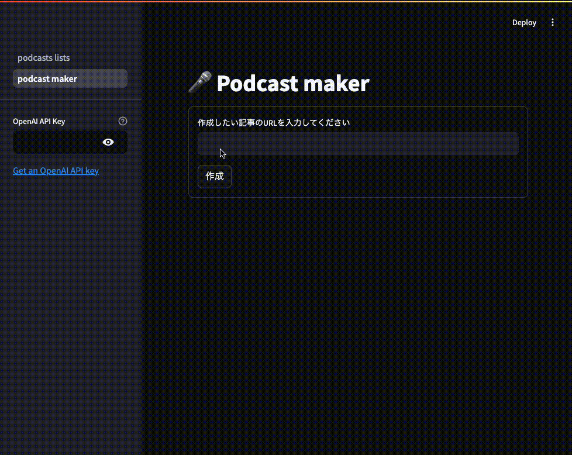
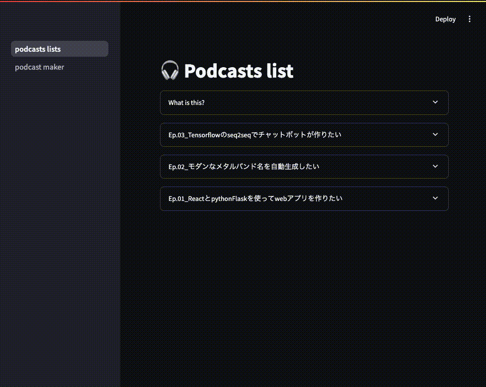

# Podcast maker

## What is this?
(エレベーターピッチ)
- `気になったテック系記事を耳で聞いて勉強` がしたい
- `駆け出しエンジニア` 向けの、
- `Podcast maker` というアプリは、
- `Podcast自動生成AIアプリ` である。
- これは `気になった記事のURLを入力するだけでポッドキャスト音声ファイルの生成` ができ、
- `記事を目で読んでキャッチアップすること` とは違って、
- `架空のエンジニア二人による記事の解説音声でキャッチアップする方法を提供する機能` が備わっている。


## 機能
- テック系記事のURLを入力することで、記事の内容を紹介するポッドキャスト風音声ファイルを出力する
- 生成されたポッドキャスト音声の一覧から、その場で音声を聞いたり、元記事のリンクに飛んだりすることができる

### 内部フロー概要
1. 入力されたURLからタイトルと本文データをスクレイピング
2. 本文データから不要な文字列を除去
3. OpenAI API(text generation)を用いてラジオ原稿を作成
4. OpenAI API(text to speech)を用いて作成した原稿の読み上げ音声を作成
5. BGMを付与して完成

### デモ
#### ポッドキャスト作成画面


#### ポッドキャスト一覧画面



## 実行方法
### 実行環境
```
Python >= 3.12
Poetry >= 1.8.0
```

- 補足：poetryのインストールは下記を参照
    - https://python-poetry.org/docs/#installing-with-the-official-installer

### アプリの起動方法
(ローカルの場合)
1. 初期設定
    1. `.env` ファイルに自身のOPENAI APIキーの情報を追記する
        - `OPENAI_API_KEY=`の部分にペーストする(クォーテーション等は不要)
        - 補足：APIキーの作成は下記を参照
            - https://platform.openai.com/api-keys
    2. BGM用音声ファイルを準備する
        - BGMに利用する音声ファイルを `podcast_maker/app/template/` の下に配置する
        - 必要に応じて `podcast_maker/app/config.py` に記載されているBGM用音声ファイル名を修正する
        - 補足： [こちらのフリー音源](https://dova-s.jp/bgm/play2452.html) を利用することを想定している
    3. 必要なパッケージをインストールする
        - `cd podcast_maker/app/`
        - `poetry install`
2. アプリを起動
    - `poetry run streamlit run podcasts_lists.py`
3. ブラウザ上で http://localhost:8501にアクセスする
